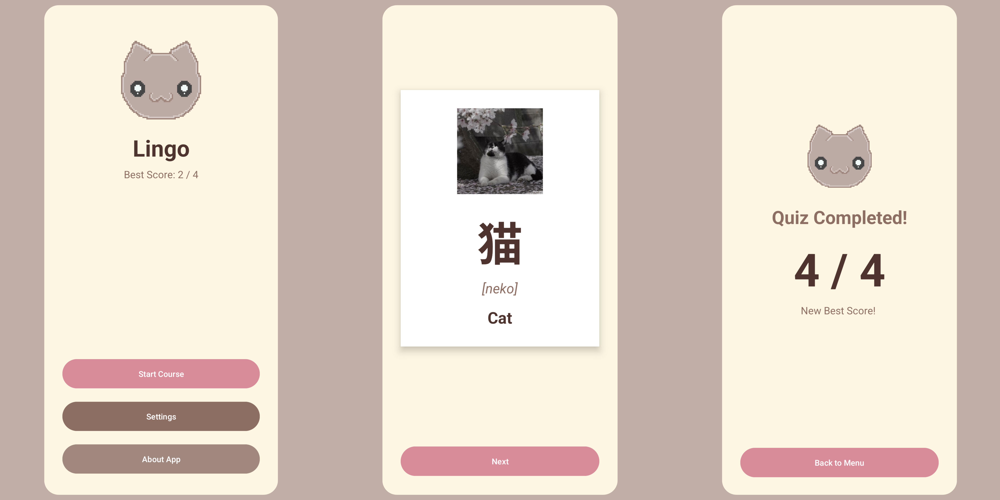

# Lingo MVP

Lingo is a mobile application for learning Japanese Kanji, developed as a project for a mobile development course

## Key Features
* **Learning:** Interactive flashcards featuring Kanji, Romaji readings, and translations
* **Testing:** A built-in quiz system to verify acquired vocabulary
* **Settings:** User preferences to toggle sound effects
* **About:** Information regarding the application and the developer

## Tech Stack
* **Language:** Kotlin
* **Architecture:** MVVM (Model-View-ViewModel)
* **Navigation:** Android Navigation Component
* **Data Persistence:** SharedPreferences
* **UI/Layout:** ConstraintLayout

## Getting Started
1. Clone this repository
2. Open the project in **Android Studio** (Flamingo version or later)
3. Wait for the **Gradle** sync to complete
4. Run the app on an emulator (API 33+ recommended) or a physical device

## App Interface Showcase

  

